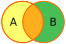

# Note 24

Parts of this note are adapted from *zyBook ISBN 979-8-203-22143-8* and
*Wikipedia*. Diagrams by GermanX - Own work, CC BY-SA 4.0 through Wikipedia
commons.

## Join queries

Left outer, right outer, and full outer joins can be illustrated with Venn
diagrams.

Venn diagram representing a left outer join between tables A and B.

Venn diagram representing a right outer join between tables A and B.

Venn diagram representing a full outer join between tables A and B.

## Alternative join queries

Inner joins can be written without the `JOIN` keyword. Outer joins can be
written with a `UNION` keyword.
